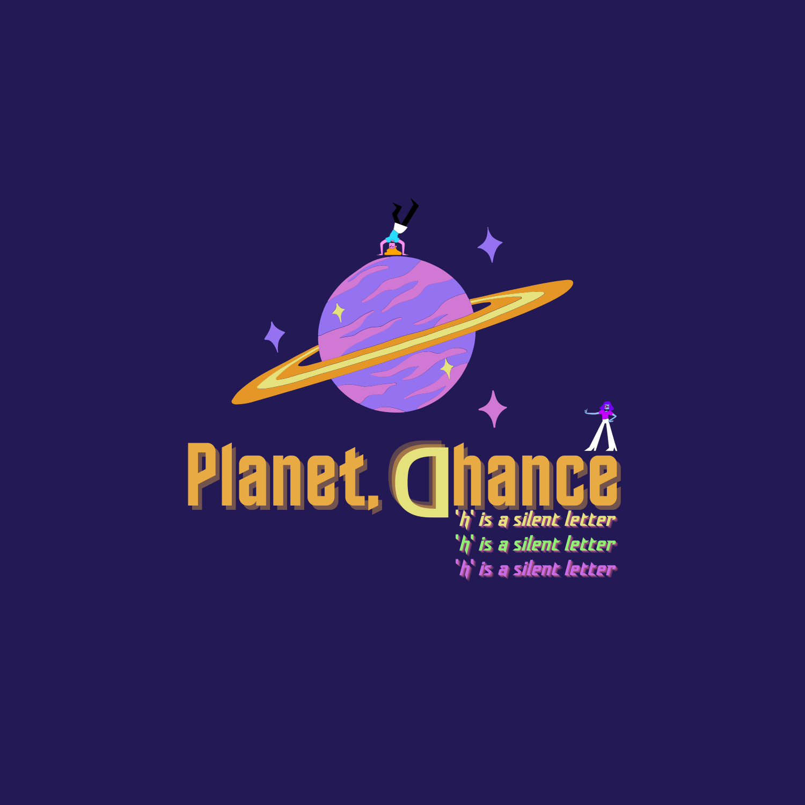
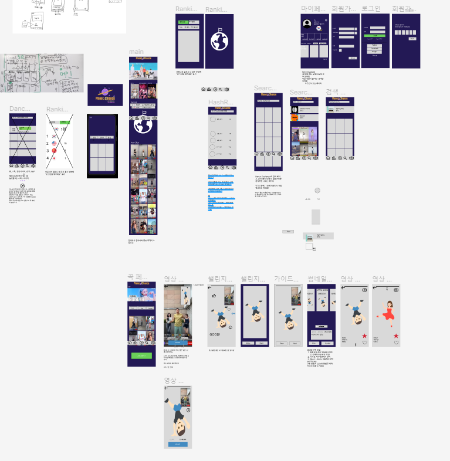
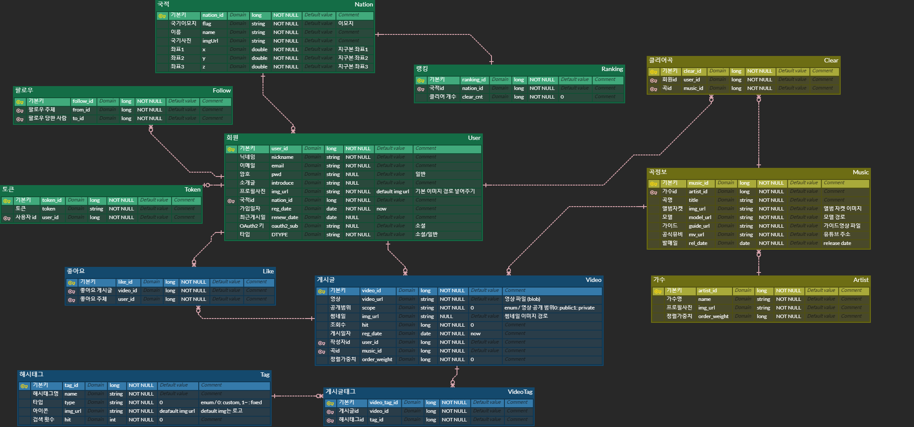
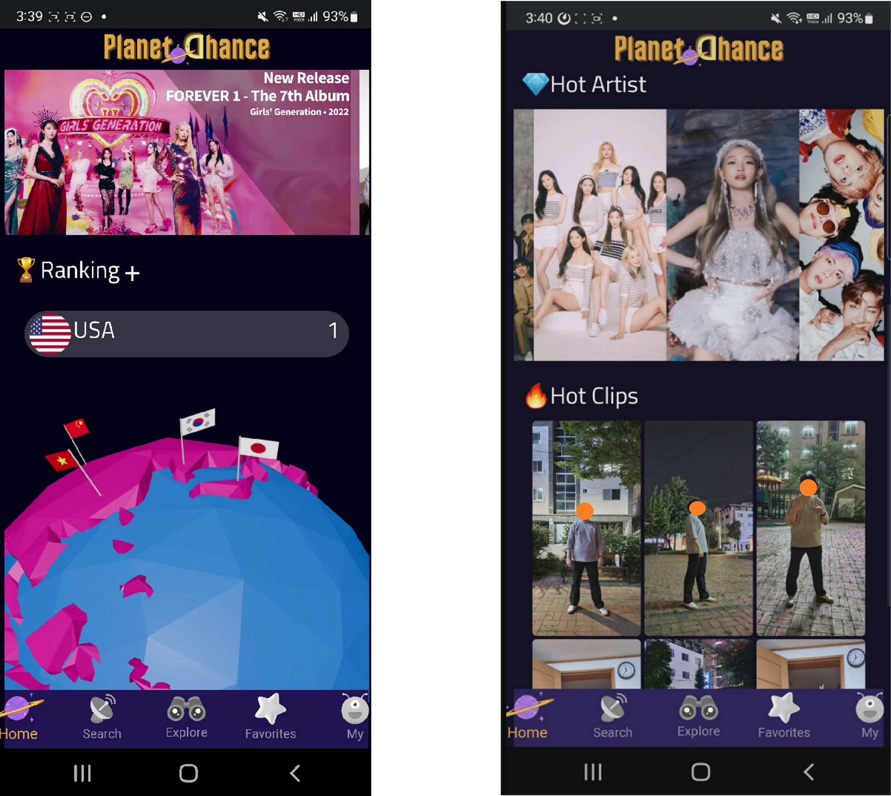
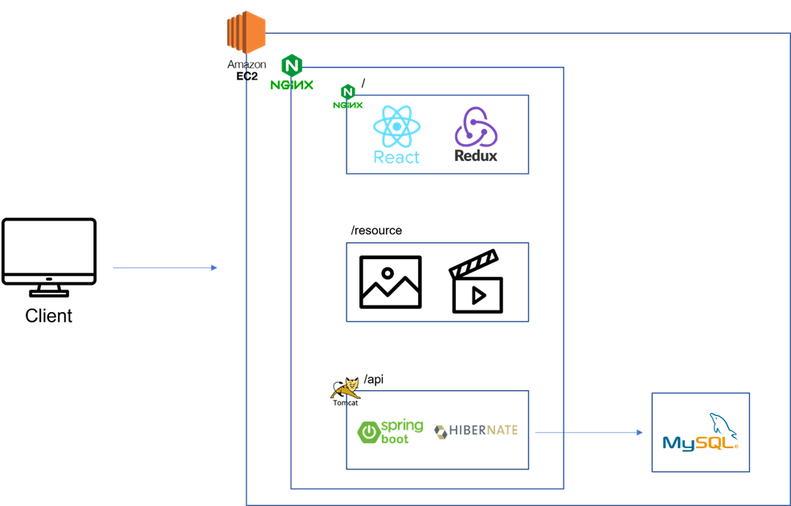

# README

  

# 🪐 Planet. Dhance

**Planet. Dhance**는 K-pop을 사랑하는 팬들에게 쉽게 댄스 챌린지에 참여할 수 있는 기회를 제공하는 플랫폼 프로젝트입니다. 유저들이 챌린지에 직접 참여할 수 있도록 모바일 서비스로 기획했습니다. Planet. Dhance의 기획 의도는 모두가 참여할 수 있는 플랫폼과 모션 인식 기술 개발 경험입니다.

**Planet. Dhance** : 누구나 쉽게 춤**_dance_**에 도전**_chance_**할 수 있는 기회를 제공하는 행성, **Planet. Dhance**!

---

### 목차

[프로젝트 기획](#프로젝트-기획)
- 기획 배경
- 주요 서비스 기능
- 와이어프레임
- UI 디자인
- ERD

[결과물](#결과물)

[기술스택](#기술스택)

[팀소개](#팀-소개)

---

## 💡 프로젝트 기획

### 기획 배경

- 최근 K-pop을 사랑하는 글로벌 팬이 굉장히 많아지며 영향력 상승
- 아티스트가 댄스 하이라이트 영상을 올리면, 다른 아티스트나 팬이 영상을 따라 추는 활동인 댄스 챌린지는 앨범 성공의 척도라고 할 수 있을 만큼 중요
- 챌린지 참여를 위해서 안무를 찾고, 연습하고, 외워야 한다는 진입 장벽을 낮추기 위한 서비스의 필요성
- 잘 추는 사람이든, 못 추는 사람이든 즐겁게 참여할 수 있는 서비스의 필요성

### 주요 서비스 기능

- K-pop 댄스 챌린지 참여 플랫폼
- 안무 숙련도가 낮은 상태에서도 챌린지에 참여할 수 있게 가이드 영상 제공
- 모션인식 기반의 실시간 피드백 제공
- 성취감을 위한 업적 및 랭킹 시스템 도입

### Mock-up

[Figma Link 바로가기](https://www.figma.com/file/HvYuNhtpBv1Y4bmKpPWtIC/Lemonmul?node-id=69%3A169&t=FpbvU5ZNuyAWBd5W-1)

  

### ERD

## 💜 결과물

### Main

  

### Search

  

### Challenge

  

## 🏁 Run

[포팅매뉴얼 링크](./exec/공통PJT_구미2반_D201_포팅매뉴얼.md)

## 🛠️ 기술 스택

### Backend

### Frontend

### Infra

## 🔨 System Architecture

## 🍋 팀 소개

### Team. lemonmul

SSAFY 7기 구미 1반 D108팀 한잔의 🍋레몬물🍋로 시작하는 갓생을 사는 그/그녀들에게 꽂혀버린 팀원들

###  [Team Notion](https://www.notion.so/Planet-Dhance-1d7765d3cfab4a8d88af57d40e420962)

### Teammates

| 이름   | 김효은     | 엄성현   | 임소연 | 전효인  | 정동규  | 지승영   |
| ------ | ---------- | -------- | ------ | ------- | ------- | -------- |
| 포지션 | BE, 팀장   | FE       | FE     | BE      | BE      | FE       |
| GitHub | [Chosephine](https://github.com/Chosephine) | [eomsteve](https://github.com/eomsteve) | [Im-sy](https://github.com/Im-sy)  | [zaq1290](https://github.com/zaq1290) | [1217jdk](https://github.com/1217jdk) | [jisy2718](https://github.com/jisy2718) |

